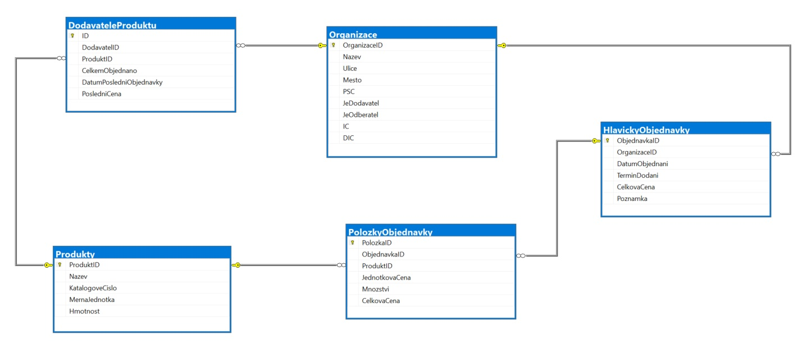

# Orders Database

## Introduction

This project is created by using pure **T-SQL** and creates a simple database and entities for managing:
- Organizations
- Products
- Orders
- Orders details
- Product vendors

## ERD

Diagram for explaining the relationships between entities in the database.

